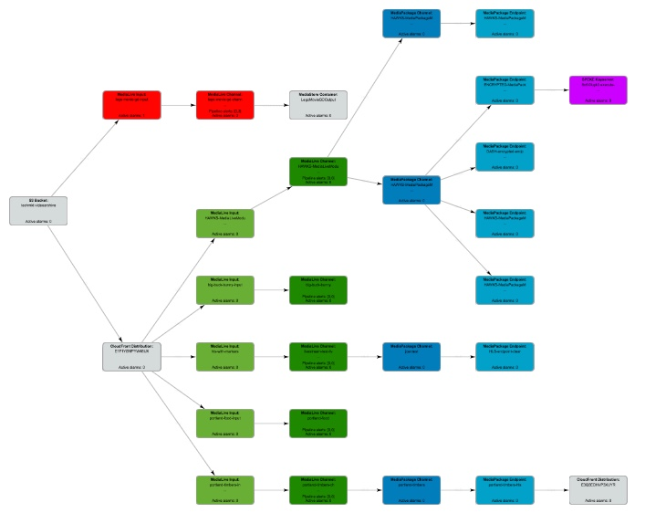
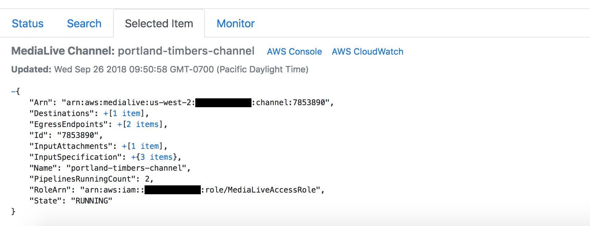
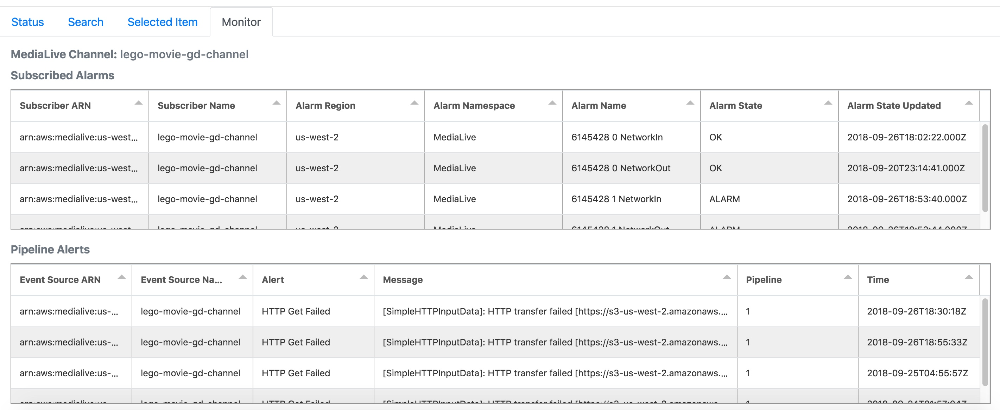
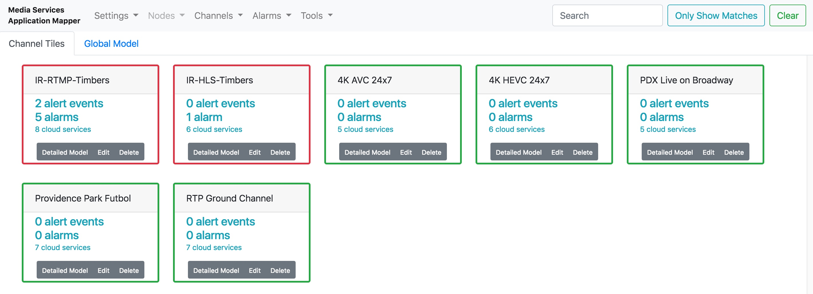

# Media Services Application Mapper (MSAM)

## Overview

* MSAM is a browser-based tool that allows operators to visualize the structure and logical connections among AWS Media Services and supporting services in the cloud
* MSAM can be used as a top-down resource monitoring tool when integrated with CloudWatch
* MSAM is installed into an AWS account with several CloudFormation templates

### Global Model

* The tool visualizes cloud resources as nodes on a diagram, and connections between resources as directed edges

 
* Simple and complex workflows of Media Services resources can be discovered and represented
* Different types of service resources are visualized with unique color and textual indicators

The following image shows a complex workflow including resources for AWS S3 buckets, CloudFront, MediaLive, MediaStore, MediaPackage, and a SPEKE key server.

* MSAM is designed to be extended with new node types, connection discovery, visualization overlays, and tools
* Custom nodes can be added within the browser application directly, or cached into a database through a cloud-side task

The following image of an MSAM diagram shows on-premise equipment: Elemental Live encoder and several Firewalls with connectivity to cloud resources

* MSAM provides configuration data for each resource on the diagram

The following image shows the JSON configuration of a diagram node when it is selected in the diagram. This is the same configuration you would see from the response to a List or Describe API call directed to the service.

### Channel Tiles

* The tile view aggregates resources into a single item that collectively provide a streaming video channel
* Tiles can be created interactively, or through the REST API for bulk operations

The following image shows a tile view with seven tiles defined. Each tile indicates the number of alerts and alarms aggregated from the underlying resources associated with the tile. Each tile also provides navigation back to the tile's resources on the diagram.

* The tile view displays the aggregated media service configuration information for all resources included in the tile

The following image shows the aggregated JSON configuration of all the diagram elements assigned to the tile.

### Resource Monitoring

* MSAM integrates with CloudWatch events and alarms to indicate operational problems from a top-down view
* Any CloudWatch alarm can be associated with any node on the diagram
* CloudWatch alarm indicators are visualized as color and text on the node
* Displays MediaLive pipeline alerts on MediaLive channel nodes
* CloudWatch high-resolution alarms can be used for frequent ten-second notification intervals

The following image shows a MediaLive input with an alarm status, and a MediaLive channel with an alarm status and three set alerts on pipeline 1.

* MSAM's Monitor tab provides subscribed alarm and alert summary for each resource on the diagram

The following image shows the Monitor tab after selecting a MediaLive channel in the diagram that was showing several alarms and alerts.

Channel tiles aggregate all configuration and status from the underlying assigned elements. If any diagram node goes into alert or alarm status, the channel tiles associated with that node will also show the same status. See the image below.

### REST API

All browser actions are performed through an authenticated and SSL encrypted REST API hosted in the cloud. The API can be used by other tools to perform activities such as preloading channel tile definitions or adding custom content to the cache.

## Navigate

Navigate to [README](README.md) | [Workshop](WORKSHOP.md) | [Install](INSTALL.md) | [Usage](USAGE.md) | [Uninstall](UNINSTALL.md) | [FAQ](FAQ.md)
